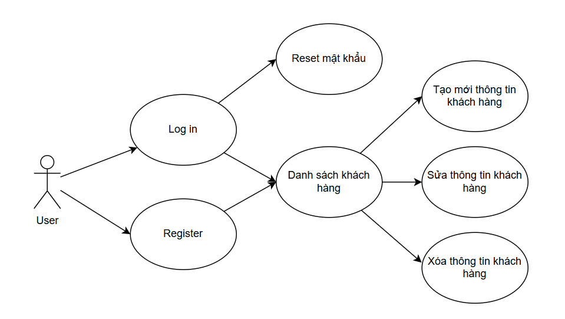

# Project: Quản lý bãi giữ xe

## Tạ Văn Thanh - 22010161

## Introduction
Đây là một trang web đơn giản được xây dựng bằng **Laravel**, giúp cho người dùng có thể quản lý danh sách các xe ra vào bãi

## How to Deploy
### Clone the Repository:
git clone https://github.com/ThanhTajj/quanlibaigiuxe.git  
cd quanlybaigiuxe
### Install Dependencies:
composer install  
npm install
### Set Up Environment Variables:
cp .env.example .env  
php artisan key:generate
### Configure Database Settings:
Edit the .env file:  
DB_CONNECTION=sqlite  
DB_HOST=127.0.0.1  
DB_PORT=3306  
DB_DATABASE=/workspaces/quanlibaigiuxe/quanlybaigiuxe/database/db.sqlite  
DB_USERNAME=root  
DB_PASSWORD=  
### Run Migrations and Seed the Database:
php artisan migrate --seed
### Start the Local Development Server:
php artisan serve
### Visit the Application:
https://literate-eureka-jjj6497p7wj35g4v-8000.app.github.dev/

## UI

    
    
    

## UML diagram
### Use Case

### Sequence diagram
Login sequence diagram

Register sequence diagram

Reset password sequence diagram

Costumer list sequence diagram

Create sequence diagram

Update sequence diagram

Delete sequence diagram
